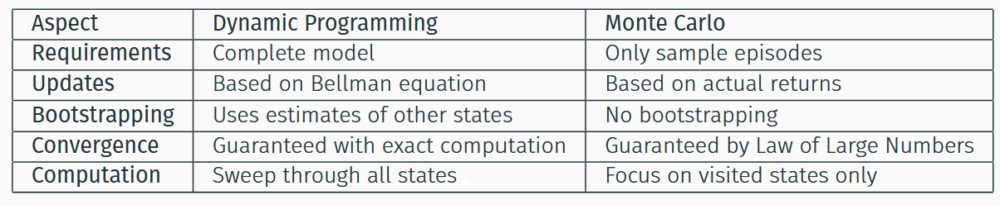

### 1.Introduction to Monte Carlo vs. Dynamic Programming

**Dynamic Programming**

>Requires a complete model of the environment. It updates value estimates based on the Bellman equation, using the estimates of other states (a process called bootstrapping) 

**Monte Carlo**

>Are model-free, meaning they do not need to know the environment's dynamics. They learn by generating sample episodes and averging the observed returns. MC methods do not bootstrap; they wait until the end of an episode to update value functions based on the actual, final return

***
### 2.Monte Carlo Policy Evaluation

>The goal of policy evaluation is to estimate the value function $V^{\pi}(s)$ for a given policy $\pi$. MC methods achieve this by:

1. Generate episodes following policy $\pi$
2. For each episode, compute the return Gt from each state s
3. Average all returns observed from state s

$$G^{\pi}(s)≈\frac{1}{n}\sum^{n}_{i=1}G_{i}(s)$$

**Key insight**

>As we collect more episodes, our estimates converge to the true values by the **Law of Large Numbers**

**First-Visit vs. Every-Visit**

>When a state is visited multiple times in one episode, "first-visit MC" only considers the return from the first time the state was visited, while "every-visit MC" averages the returns from all visits

>The main advantage of MC over DP is: No model required

***
### 3.Monte Carlo Control

>MC Control aims to find the optimal policy. Since a model is not available, we cannot use V(s) to find the best action. Instead, we must estimate the action-value function, Q(s,a)

#### 3.1 The Exploration Problem

>To learn the optimal Q-values, the agent must explore all possible actions from all states. If the policy is deterministic, it will only ever sample one action per state, preventing exploration. This is solved using stochastic (non-deterministic) policies

**Ways to solve the exploration problem**

1. Exploring Starts
2. $\epsilon-greedy$ 

**$\epsilon-greedy$ policies**

$$
f(x)=\left\{
\begin{matrix}
1-\epsilon+\frac{\epsilon}{|A(s)|} & {if~a=~\arg\max_{a'}Q(s,a')} \\ \frac{\epsilon}{|A(s)|} & otherwise
\end{matrix}
\right.
$$

#### 3.2 On-policy Methods

• Evaluate and improve the policy that is used to make decisions
• The policy being learned is the same as the policy being followed
• Must use stochastic policies to maintain exploration

>This method finds an optimal _near-optimal_ policy, not the true optimal one, because it must always maintain some level of exploration.

#### 3.3 Off-policy Methods

• Learn about one policy while following a different policy
• Target policy: what we want to learn about
• Behavior policy: what we use to generate experience

**The Exploration-Exploitation Dilemma**

• Want to learn about the optimal policy (deterministic, greedy)
• Need to explore to find all good actions (stochastic, random)
• Can’t do both with the same policy!

**Off-policy Solution**

• Target policy π: The policy we want to evaluate/improve (can be
deterministic)
• Behavior policy b: The policy we use to generate data (must be
stochastic)
• Learn about π from data generated by b

**Importance Sampling**

>This method allows learning the true optimal policy while still exploring

***
### 4.Limitations of Monte Carol Methods

* They only work for **episodic tasks** (tasks with a clear end)
* Learning only occurs at the end of each episode, which can be slow.
* The returns can have high variance, potentially requiring many episodes to converge
