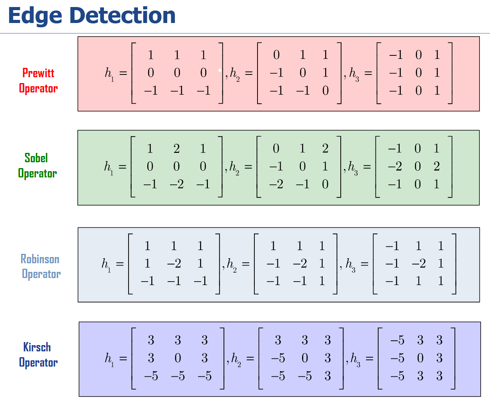

### 1. Introduction to Edges

**Characterizing Edges**

>An edge is defined as a location of rapid change in the image intensity function.
>
>The first derivative of the intensity function shows peaks at these locations

**Edge Detection Concept**

>The process involves examing the rate of change (gradient) of intensity near a pixel to determin if it's part of an edge.
>
>This is often done using convolution with specific kernels (masks)

### 2.First-Order Edge Detection Operators

#### 2.1 Common Opeartors

#### 2.2 Magnitude and Direction

**Gradient Magnitude**

$$g(x)=\sqrt{g_x^2+g_y^2}$$

**Gradient Direction**

$$tan^{-1}(g_{y}/g_{x})$$
>Edges have both strength (gradient magnitude) and direction, which can be calculated from the results of horizontal and vertical convolution masks

### 3.The Canny Edge Detector

#### 3.1 Canny's Criteria

**Good Detection:** Low probability of missing real edges or falsely detecting non-edges.

**Good Localization:** Detected edge points should be as close as possible to the true edge

**Single Response:** A single edge should only be detected one

#### 3.2 Algorithm Steps

1. **Gaussian Filtering**

> Smooth the image to suppress noise before calculating gradients. 
> 
> The size of the filter σ affects the scale of the detected edges: a large σ detects large-scale edges, while a small σ detects fine features

2. **Gradient Calculation**

>Compute the gradient magnitude and direction for each pixel

3. **Non-Maximum Suppression**

>Thin the edges to achieve a single-pixel-wide response by keeping only pixels that are a local maximum along the gradient direction

4. **Hysteresis Thresholding**

>* pixels with a gradient magnitude above thigh​ are accepted as "strong" edges.
>* Pixels with a magnitude below tlow​ are rejected
>* Pixels with a magnitude between the two are accepted as "weak" edges only if they are connected to a strong edge.

### 4.Second-Order Edge Detection Operators

#### 4.1 Concept

>Uses the second derivative of the image intensity. An edge is located at the zero-crossing of the second derivative

#### 4.2 Laplace Operator

#### 4.3 Marr-Hildreth Detector

### 5.Edge Grouping

#### 5.1 Purpose
#### 5.2 Method
#### 5.3 Heuristic
