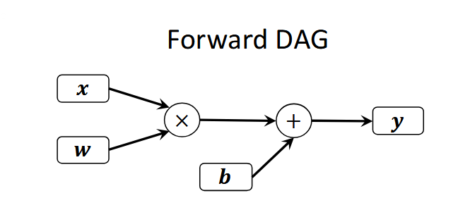
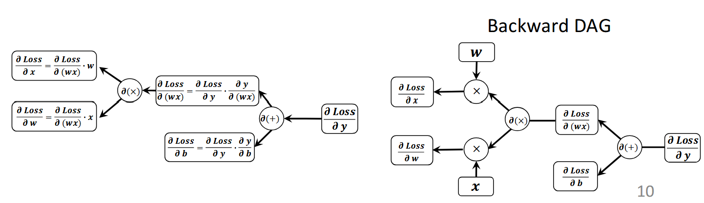

### 1.Why Compilation is Necessary

#### 1.1 Algorithmic Complexity ≠ Hardware Performance

>Depth-wise convolution: fewer FLOPs but limited parallelism, high
>memory bandwidth cost

End-to-End performance depends on:

$$e2e\_Perf = F(FLOPs,Infrastructure,Hardware)$$
#### 1.2 Role of ML compilers

* Bridge between algorithm and hardware
* Decide how computation is scheduled, fused and mapped to specific hardware units
* Translate algorithmic improvements into real speed-up

### 2.The Five Stages of an ML Compiler

#### 2.1 Front-end API for model construction

**Imperative Programming**

>**Philosophy**: Build and Execute (Pytorch)
>
>**Advantages**:
>
>* Easier for debugging: inspect tensors at any point
>
>* Beginner-friendly: familiar Python control flow

**Declarative Programming**

>**Philosophy**: Build then Execute (Early version of TensorFlow)
>
>**Advantages**:
>
>* Easier for compilers to optimize
>
>* Well-suited for distributed execution and batching

#### 2.2 Dataflow graph construction

**Why**

* Makes data dependencies explicit
* Facilitate graph / tensor optimizations

**Representation (DAG):**

* Directed acyclic graph (DAG)
* Rectangle node: tensor with shape, dtype, layout, etc.
* Square node: operation with attributes (e.g., stride, padding)
* Edges: data dependencies and control flow

**Inference:** forward DAG only

**Training:** forward + gradient update DAG

* Gradient update DAG is constructed by Autodiff engine
* Autodiff engine: Forward Mode Autodiff* & Backward Mode Autodiff (Link)
* As Backward Mode is mainstreaming, this module only focus on this

**Gradient Decent:**
$$w^{t+1}=w^{t}-𝜼\frac{\partial{Loss}}{\partial w}$$
#### 2.3 Intermediate Representation

**Why**

* Bridge between high-level models and low-level kernel execution
* Provides richer, structured abstraction for advanced graph & tensor optimizations

**Key Design Principles**

* **Abstraction**: Remove unnecessary details to simplify transformations 
* **Layered Representation**: Different IRs for different optimization scopes
* **Lowering Pathway**: IRs gradually transform computations into backend-executable

**Multi-Level Intermediate Representation**

**Key design philosophy:**

>• Multi-Level IRs: Capture computation at different levels of abstraction
>
>• Progressive lowering: Gradually refine high-level IRs into lower-level ones
>
>• Extensibility via Dialects: Easily define domain-specific ops/types with custom semantics
>
>• Dialects: a logical grouping of Ops, attributes and types under a unique namespace

**Trade-offs and Limitations:**

>• Increased IR Complexity: Complexity shifts to managing dialects and lowering
>passes
>
>• Steep Learning Curve: Requires understanding of dialect design, and
>transformation rules

#### 2.4 Graph/Tensor Optimations

**1. Operator Fusion**

>Combine adjacent ops into a single fused op to reduce overhead

**Benefits:**

• Reduced kernel launches

• Lower memory access & transfer cost

• Better backend-specific fused kernels

**2. Constant Folding**

>Fold constant subexpressions at compile time to reduce runtime computation

**Benefits:**

• Eliminates redundant calculations

• Reduces runtime overhead

• Simplifies computation graph

**Can be applied in high-level IRs in early stage**

**3. Tiling**

>divide large computations into smaller blocks (tiles) that fit in memory/cache

#### 2.5 Kernel Execution

**Two main backend strategies**

**Vendor-optimized libraries**

• Call precompiled kernels (e.g., cuBLAS, cuDNN, MKL, MIOpen)

• High performance with minimal codegen overhead

• Limited flexibility and harder to fuse or schedule across ops.

**Custom kernel generation**

• Generate hardware-specific code (e.g., CUDA, Triton, Metal, or C++)

• Enables kernel fusion, layout tuning, tiling, etc.

• More flexible and tunable, but codegen is more complex.