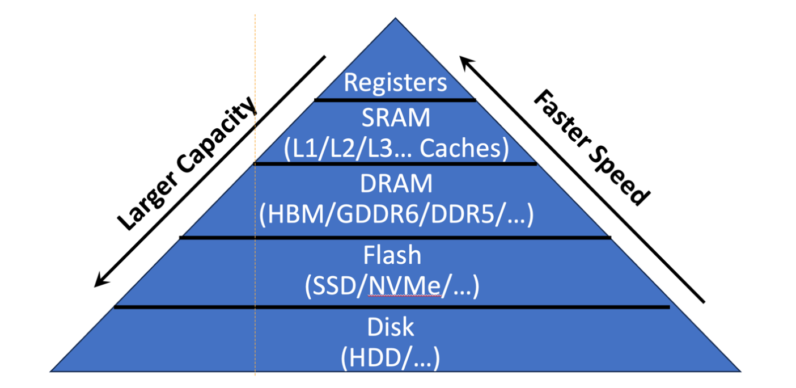

### 1.Core Concepts in Computer Architecture

#### 1.1 Core Concepts:

Covers the main components of a hardware system:

Processing, Communication, and Storage

#### 1.2 The Von Neumann Architecture

A fundamental model with unified memory for instructions and data

#### 1.3 Performance Metrics

The trade-off between Performance 

**Performance (P)**

* **Latency**: Time to complete a task
* **Throughput**: Tasks completed per time unit

**Power (P)**

* Energy consumption over time
* Affects thermal performance and battery life

**Area (A)**

* Physical silicon footprint
* Influences cost, yield, and scalability

**Impacting Factors:**

* Hardware architecture
* Technology node

### 2.Key Challenges and Trends

#### 2.1 Moore's Law

>The observation that the number of transistors on a chip doubles approximately every two years.
#### 2.2 A New Golden Age for Computer Architecture

>With the slowdown of Moore's Law, performance gains increasingly come from architectural innovation like GPUs and Domain Specific Architectures (DSAs)
#### 2.3 The Memory Wall

>The growing performance gap between fast processors and slower memory, creating a bottleneck

### 3.The Memory Hierarchy

#### 3.1 Registers

* Fastest, smallest, closest to ALU
* Transistor counts >10 (~30-40) per bit
* Capacity: ~KBs (area constraints and port complexity)
* Bandwidth: Very high (single-cycle access)

#### 3.2 SRAM (L1/L2/L3 Caches)

* Intermediate latency and capacity
* Transistor counts: 6 per bit
* Capacity: Tens of KBs to MBs
* Bandwidth: High (few cycles)

#### 3.3 DRAM

* Larger, slower (depends on generation)
* Transistor counts: 1 transistor + 1 capacitor per bit
* Capacity: ~ GBs
* Bandwidth: Lower than caches

#### 3.4 Flash

* Non-volatile storage
* Capacity: 100s of GB to TB

#### 3.5 Disk

* Mechanical, slowest
* Capacity: TB+

