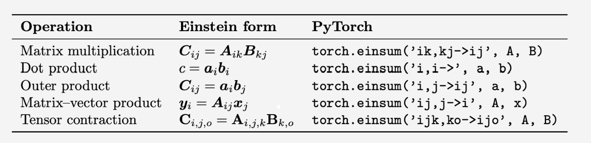

### 1.Mathematical Foundation

#### 1.1 Basic Mathematical Objects

**Real Valued Variable**
$$x\in R$$

**generalize this to n demensions**
$$x\in R^{n}$$

**Vectors are by default column vectors**
$$x\in R^{n \times 1}$$

**generalize vectors into matrices**

$$X\in R^{n \times m}$$

$$X=\left[
\begin{matrix}
X_{1,1} & X_{1,2} & \dots & X_{1,m} \\
X_{2,1} & X_{2,2} & \dots & X_{2,m} \\
\dots & & & \dots\\
X_{n,1} & X_{n,2} & \dots & X_{n,m}\\
\end{matrix}
\right]$$

#### 1.2 Tensors and Operations

* Tensors are a further generalization with multiple dimensions.

* Tensors contraction is defined for multiplication

#### 1.3 Einstein Notation

**A few basic rules:**

* if an index appears once, it is not summed over

* if an index appears twice it is summed over

* no index should appear more than twice

$$C_{i,j}=A_{i,k}B_{k,j}$$

$$A\in R^{n \times m \times l} ~ B\in R^{l \times o}$$

$$C_{i,j,o}=A_{i,j,k}B_{k,o}$$

***
### 2.Linear Model as Functions

#### 2.1 Function View

$$f:R^{n}\rightarrow R^{m}$$

$$f^{w}(x):=Xw$$

#### 2.2 Empirical Risk Minimization (ERM)

>Learning is framed as a minimization problem to find the parameters 'w' that minimize errors.

***
### 3.Measuring Error and Defining the Loss Function

#### 3.1 Norm Spaces for Measuring Distance

**Euclidean Norm**

$$||x||_2=\sqrt{\sum x_{i}^{2}}$$

**p-norm distance**

$$||x||_p=\sqrt[p]{\sum x_i^p}$$

#### 3.2 Loss Function

>Error is measured as the squared 2-norm of the difference between predicted values (y^​) and true labels (y)

$$L(y,\hat{y})=||\hat{y}-y||^{2}_{2}$$

$$L(y,\hat{y})=||\hat{y}-y||^{2}_{2}$$

$$\theta^{*}=\arg\min_{\theta\in R^{n}}L(\theta)$$

$$L(y,\hat{y})=\frac{1}{m}\sum_{i}(y_i-\sum_{j}X_{i,j}\theta_{j})^{2}$$

>* Theoretically, using a summation instead of an average for the total loss function does not change the optimal parameters θ∗
>
>* However, in practice, it is standard to average the loss over a mini-batch. If you use a summation instead, the magnitude of the gradient will be dependent on the batch size, which effectively couples the learning rate with the batch size.

>The 2-norm corresponds to Mean Squared Error (MSE) loss, and the 1-norm corresponds to Mean Absolute Error (MAE) loss

***
### 4.Solving for Optimal Parameters via Minimization

#### 4.1 Optimization Strategy

#### 4.2 Vector Calculus for Differentiation

#### 4.3 The Ordinary Least Squares Solution
