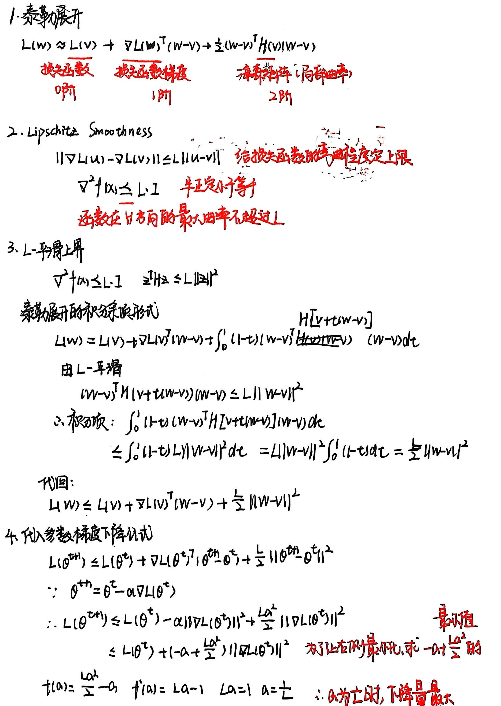
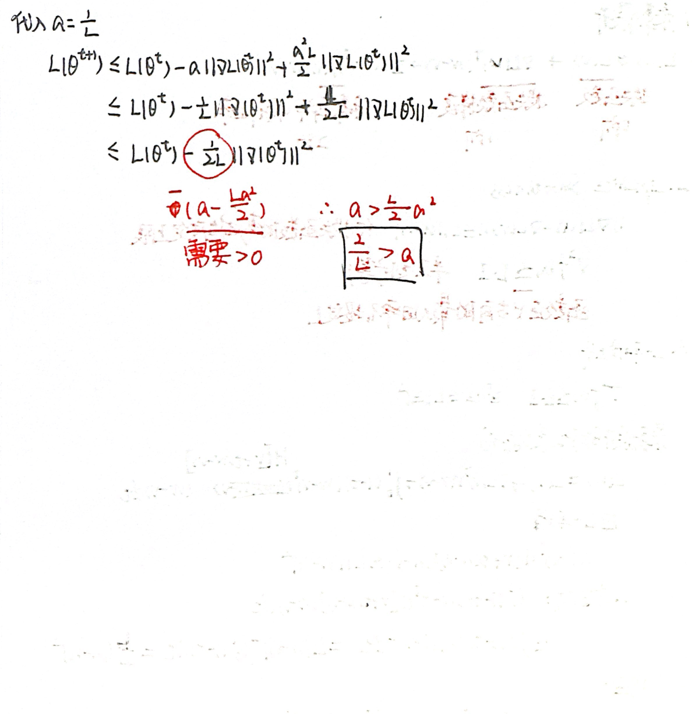
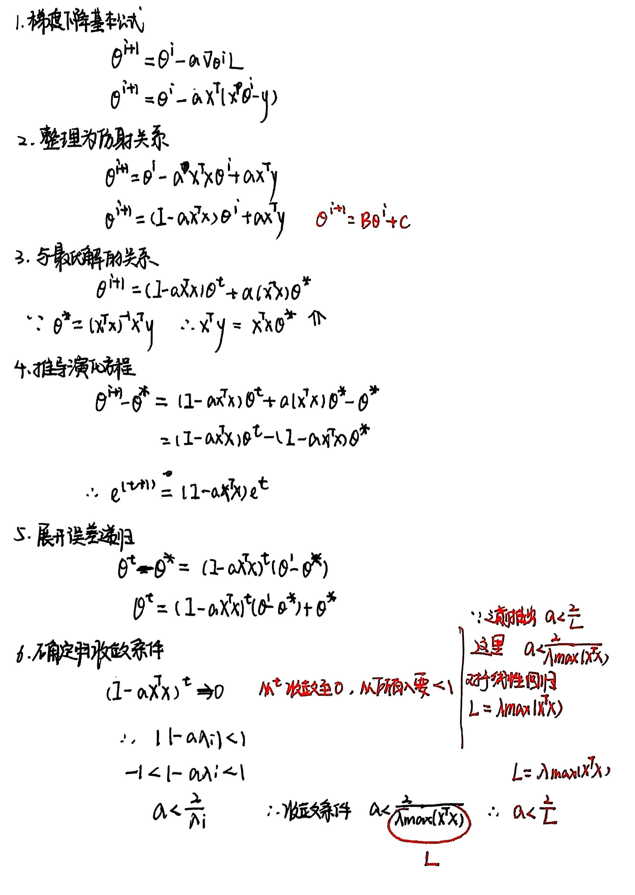

### 1.Progress Bounds for Gradient Descent

### 2.Convex Optimization

**An optimization problem is convex if and only if**

* The function is convex
* The solution set is convex

**Implications of Convexity**

* All local minimums are global minimums
* If a function is strictly convex, then the global minimum is unique

### 3.Convergence in Machine Learning / Linear Models

