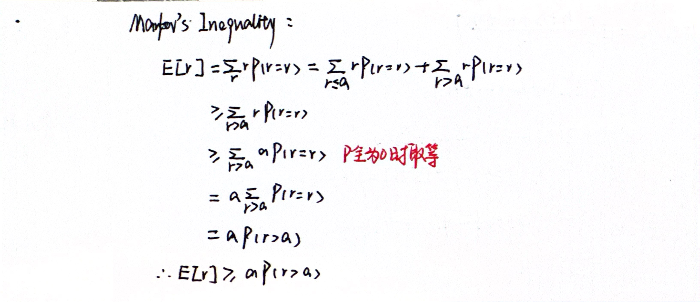
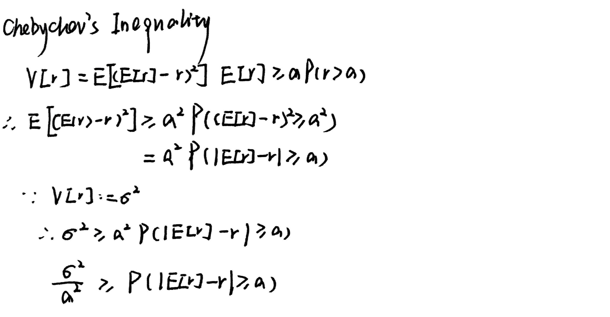
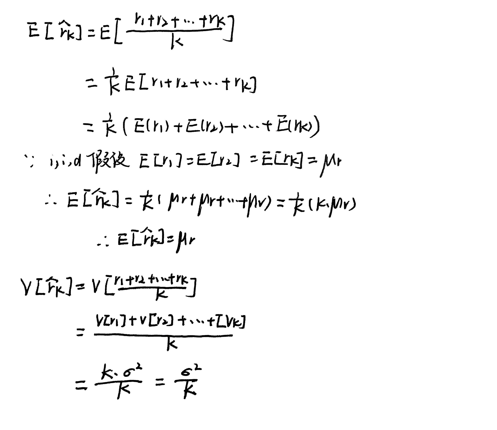
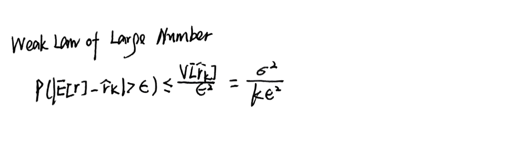
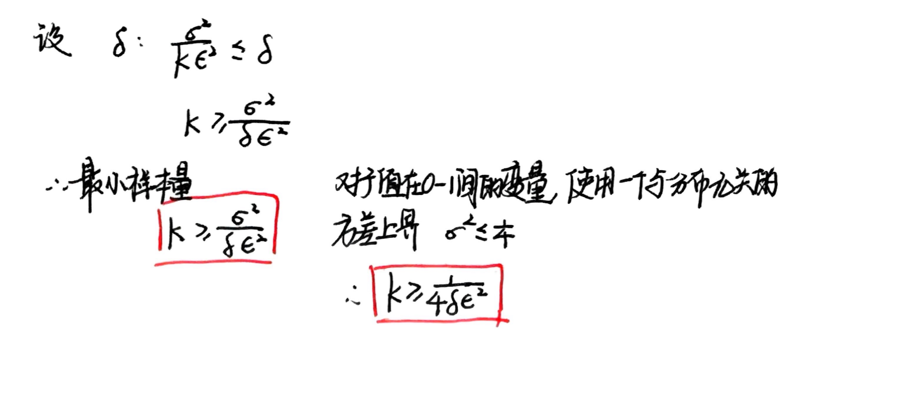

### 1.The Challenge of Model Selection and Evaluation Framework

#### 1.1 Underfitting and Overfitting

* A simple model may fail to capture the underlying trend in the data
* An overly complex model, might fit the training data perfectly but captures noise instead of the true signal. This leads to poor performance on new data

>The goal is to find a model that **generalizes well to unseen data**

#### 1.2 Risk Function for Evaluation

* To decide which model is better, we can test them in practice and measure their performance

**Empirical Risk**

$$\hat{R}_k(f^{\theta}):=\frac{1}{k}\sum^{k}_{i=1}L(f^{\theta}(x^{(i)}),y^{(i)})$$

>We prefer the model with the lower risk

* This raises a crucial question: **When do we stop the trial ?** How many samples are needed to make a reliable decision

***
### 2.A Probabilistic Approach to Generalization

#### 2.1 Modeling with Randomness

* We assume data points are sampled from a joint distribution
* The loss on each data point is treated as a sample from a random variable r

**Expected Risk**

$$E[r]$$

* The true mean loss over all possible data. This is what we care about but cannot compute directly

**Empirical Risk**

$$\hat{r}_k$$

* The sample mean loss over k data points. This is what we can compute in practice

>The main goal is to ensure that for a large enough k, our empirical risk is a good approximation of the expected risk

$$E[r]≈\hat{r}_k$$

#### 2.2 Convergence in Probability

* This concept gives a formal meaning to $E[r]≈\hat{r}_k$
* A sequence of random variables converges in probability to a value a if, as k goes to infinity, the probability that the distance between $\hat{r}_k$ and a is greater than any samll number $\epsilon$ approaches zero

**Definition**

$$\forall \epsilon \gt0,\lim_{k\rightarrow \infty}P(|\hat{r}_k-a|\geq\epsilon)=0$$

***
### 3.The Tools - Concentration Inequalities

#### 3.1 Markov's Inequality

* Provides a loose bound for any **non-negative** random variable

>The probability that a non-negative variable is greater than some value is limited by its expectation

#### 3.2 Chebyshev's Inequality

* Derived by applying Markov's inequalily to the variance of a random variable

***
### 4.The Payoff - Law of Large Numbers and Sample Size

#### 4.1 Weak Law of Large Numbers

* The law is derived by applying Chebyshev's inequality to the sample mean

**Unbiased Estimator**

**Variance decreases with sample size**

#### 4.2 Answering "How long should our trial run be"

* We frame our goal using the **Probably Approximately Correct (PAC)** framework. We want the probability that our estimate is wrong by more than $\epsilon$ to be no more than δ

* We set the bound from the Weak Law of Large Numbers to be less than or equal to our desired failure probability

#### 4.3 Generalization Bound 

* This extends the analysis from a single model to a whole class of models (or hypotheses)

$$P[\sup_{\theta \in \Theta}|R(\theta)-R_{emp}(\theta)|\gt \epsilon]\leq \frac{|\Theta|}{4n\epsilon^{2}}$$

* This shows that the generalization error depends on **the size of the hypothesis class** and **the number of sample n**

