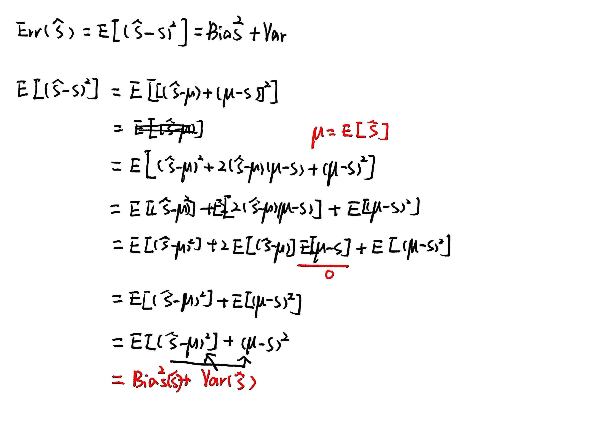
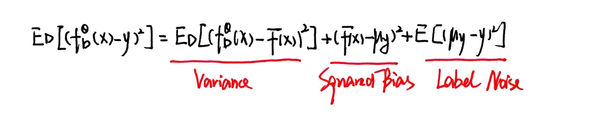

### 1.Universal Function Approximation

#### 1.1 Weierestrass Theorem

> This theorem states that any continuous function f on a closed interval [a,b] can be uniformly approximated by a polunomial function P(x). For any $\epsilon$ > 0, a polynomial P(x) exists such that the supremum norm $||f-P||_{\infty}$ is less than $\epsilon$

#### 1.2 Universal Approximation of Sum of Sigmoid Functions (Cybenko)

>This theorem states that for any continuous function f on a compact subset of $R^{n}$, there exists a sum of N sigmoidal functions, $F(x)=\sum^{N}_{i=1}w_{i}\sigma(w_{i}^{T}x+b_{i})$ that satisfies $|F(x)-f(x)|\lt \epsilon$ for all x in that subset

### 1.3 Implication for Neural Networks

>Deep neural networks can be viewed as "learned" basis functions. The Cybenko theorem confirms that (under mild conditions) deep neural networks can also approximate any function

#### 1.4 Stone-Weiestrass Theorem

>This provides a more generalized version of universal approximation. It states that a class of functions F defined on a compact set S is a universal appriximator if it satisfies four conditions:

1. each $f\in F$ is continuous
2. it contains non-zero functions
3. it separates points
4. it is an algebra (closed under multiplication and vector space operations)

***
### 2.Model Selection and Hyperparameters

#### 2.1 No Free Lunch

>This theorem in machine learning states that any two learning algorithms, 'A' and 'B', will have the same loss when averaged over all possible target functions. This implies that without any knowledge of the underlying function, there is no a priori reason to prefer one algorithm over another

#### 2.2 Parameters vs. Hyperparameters

* Hyper-parameter selection itself is a form of learning

* From an overfitting perspective, this separation is only conceptual. Arbitrarily making a parameter (like a bias term) a hyper-parameter can lead to overfitting.

#### 2.3 Dataset Usage

**Training Data**

* Used to change and choose parameters , for example, using gradient descent θ(i+1)=θ(i)−α∇θ​L(θ(i))

**Test Data**

* Used to estimate the true risk. **Warning:** As soon as you make a decision based on the test data, you invalidate your risk estimate. This is known as "training on the test data"

**Validation**

* To select hyper-parameters, a "validation" dataset is introduced. This allows hyper-parameter choices to be made, after which the test data can still be used to understand the true risk

***
### 3.K-Fold Cross-Validation

* **Problem with Validation Sets:** A simple train/validation/test split reduces the amount of data available. If the validation set is small, it may be a bad estimator of performance

* **K-Fold Cross-Validation:** This process splits the **training data** into 'k' different folds.

* **Process:** The model is trained 'k' times. In each iteration, one fold is held out for validation, and the remaining k-1 folds are used for training. The average performance across all k held-out folds is then taken as the estimate of how well that hyper-parameter setting performs

* **Leave-One-Out Cross-Validation (LOOCV):** This is the most extreme case of k-fold cross-validation, where the number of folds is equal to the number of data-points.

* **Remaining Question:** Does LOOCV provide a risk estimate that is accurate in the same way the test-data estimate is?. To answer this, we must turn to statistics

### 4.Bias-Variance Decomposition

#### 4.1 Statistic and Estimator

**Statistic**

>A statistic s is defined as a random variable that is a function of some data D

**Estimator**

>An estimator is a statistic used to quantify a parameter or property of a distribution.

#### 4.2 Bias and Variance of an Estimator

**Bias**

>The bias of an estimator is the expected difference between the estimator and the true value.

$$Bias(\hat{S})=E(\hat{S})-S$$
**Variance**

>The variance of an estimator measures its spread around its own expected value

$$Var(\hat{S})=E[(\hat{S}-E(\hat{S})^{2}]$$
#### 4.3 Estimator Error Decomposition

#### 4.4 Prediction Error Decomposition

***
### 5.Bias-Variance Trade-off in Machine Learning
#### 5.1 Conceptual Visualization

* **Low Bias, Low Variance:** Shots are clustered tightly at the bullseye.
* **Low Bias, High Variance:** Shots are spread out but centered on the bullseye
* **High Bias, Low Variance:** Shots are clustered tightly but off-center.
* **High Bias, High Variance:** Shots are spread out and off-center

#### 5.2 Underfitting (High Bias)

* The model fits for different datasets are all similar (Low Variance)
* The average fit is far from the true function (High Bias).

#### 5.3 Overfitting (High Variance)

* The model fits perfectly to the training data, capturing the noise.
* The model fits perfectly to the training data, capturing the noise.
* The average fit may be close to the true function (Low Bias).

#### 5.4 Trade-off in Linear Models

**OLS**

>The OLS estimator  is **unbiased** if the ground truth is perfectly linear (y=Xθ∗). Its expectation is E[θOLS]=θ∗.

**Ridge Regression**

>The Ridge estimator $\theta^{Ridge}=(\lambda I+X^{T}X)^{-1}X^{T}y$ is **biased**

* The bias of Ridge is $-\lambda E[\lambda I+X^{T}X]\theta^{*}$
* This shows the trade-off: Ridge regression introduces bias to reduce the model's variance, aiming for a lower total error.