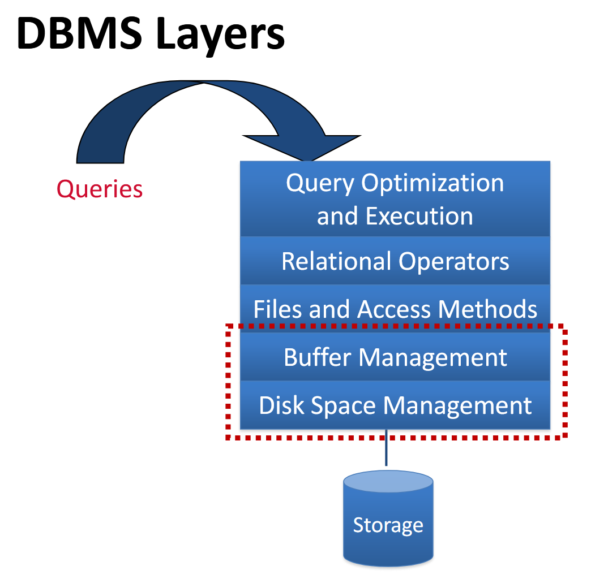
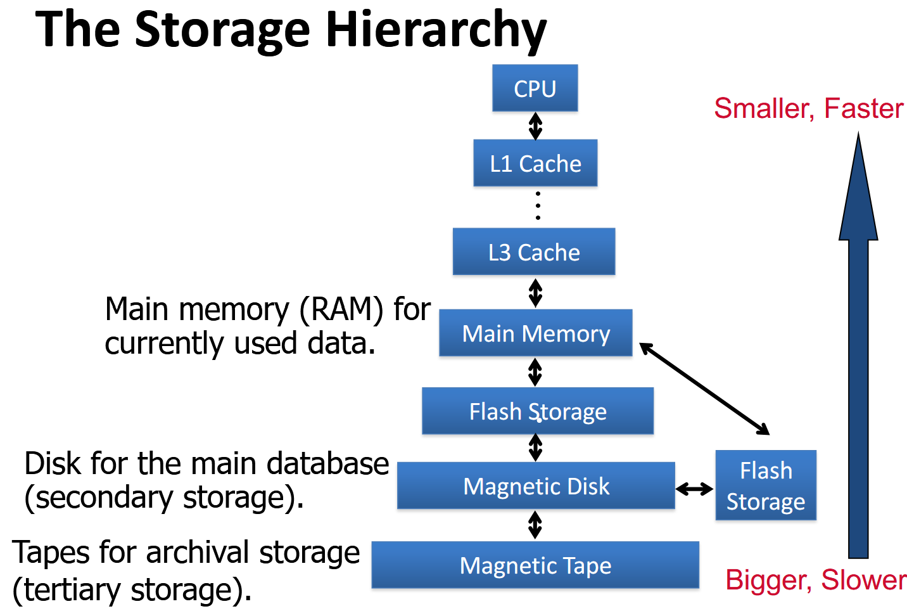
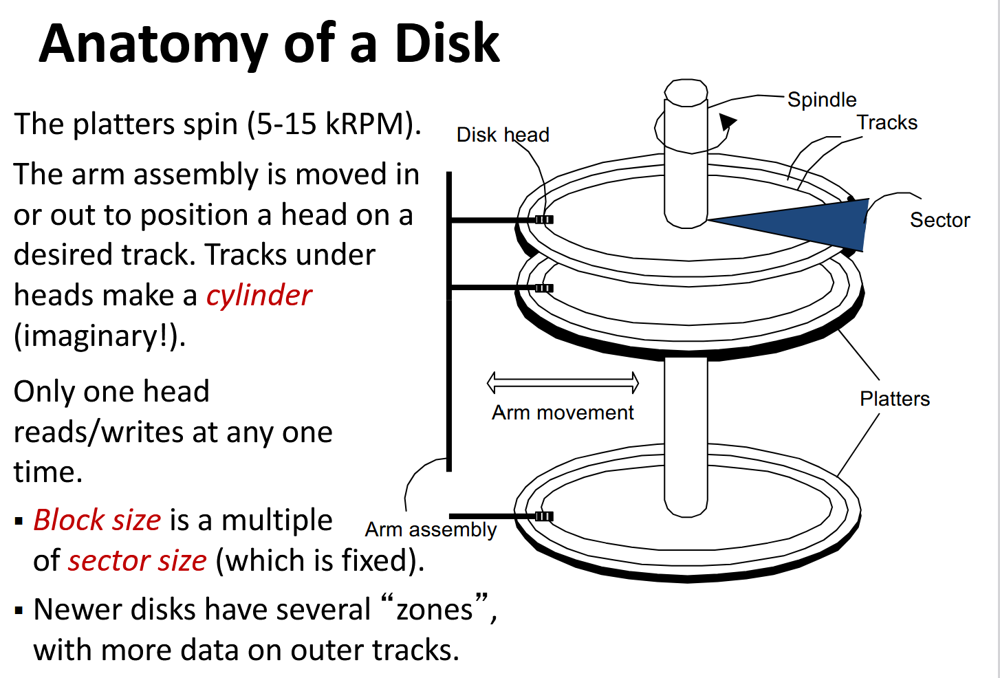

### 1.The Role of the Storage Layer
#### 1.1 Position in the DBMS Architecutre

>* **Queries**
>	
>	This is the starting point. It represents a request from a user or an application to retrieve, insert, update, or delete data from the database. These are typically written in a high-level language like SQL (Structured Query Language).
>	
>* **Query Optimization and Execution**
>	
>	This is the "brain" of the DBMS. When a query is received, this layer first parses it to understand its meaning. Then, it generates multiple possible execution plans (different ways to get the same result) and uses a cost model to choose the most efficient one. This process is called query optimization. Finally, it executes the chosen plan.
>	
>* **Relational Operators**
>	
>	The execution plan created by the layer above is composed of a sequence of relational operators. This layer provides the implementation for these fundamental operations, such as Select (selecting rows), Project (selecting columns), Join (combining tables), Sort, etc
>	
>*  **Files and Access Methods**
>	
>	This layer manages the data stored in files on the disk. It includes methods for efficiently accessing the data, such as:
>	
>	**Heap Files:** Unordered collections of records.
>	
>	**Indexes:** Data structures (like B+ trees) that allow for fast lookups of specific records based on certain values, avoiding a full scan of the table.
>	
>* **Buffer Management**
>	
>	Accessing data from the disk is significantly slower than accessing it from main memory (RAM). This layer manages a section of RAM called the buffer pool. When data is needed, it's fetched from the disk and placed into this buffer. This layer decides which data pages to keep in memory (e.g., frequently accessed ones) and which to write back to disk when the buffer is full, using policies like LRU (Least Recently Used).
>	
>* **Disk Space Management**
>	
>	This lowest software layer is responsible for managing the storage space on the disk. It keeps track of which blocks on the disk are free and which are occupied. When a new page of data needs to be stored, this layer allocates a block of space for it. It manages the physical placement of data on the storage device.
>	
>* **Storage**
>	
>	This represents the physical hardware, such as a Hard Disk Drive (HDD) or Solid-State Drive (SSD), where the database is permanently stored.
> 

#### 1.2 Why DBMS Manages Its Own Storage

>While OS abstractions are generally useful, a DBMS requires fine-grained control that the OS often obstructs.

**Specific Needs:**

- Specialized data prefetching strategies.
- Control over buffer replacement policies, as the default LRU (Least Recently Used) is not always optimal for database access patterns
- Control over process scheduling to avoid issues like the "convoy problem" where OS scheduling conflicts with DBMS locking.
- Precise control over when data is flushed to disk, which is essential for recovery protocols like Write-Ahead Logging (WAL).

***
### 2.The Storage Hierarchy and Mediums

#### 2.1 Disk vs. Main Memory Trade-off

>**Disks** are the traditional secondary storage device of choice for most databases because they are non-volatile and cost-effective for large datasets.

Storing the entire database in **main memory (RAM)** is often impractical due to:

* **High Cost:** Especially for modern petabyte-scale databases.
* **Volatility:** Main memory loses its data when power is lost

#### 2.2 The Rise of Flash Storage

>Flash storage (SSDs) has become a key technology in modern systems

>In a DBMS, it can be used as the **main storage** medium or as an **accelerator** (e.g., for caching or logging)

#### 2.3 The Complete Stroage Hierarchy

>Data storage is organized in a hierarchy from smaller, faster, and more expensive mediums to larger, slower, and cheaper ones.

***
### 3.Understanding Hard Disk Drives (HDD)

#### 3.1 Anatomy of a Disk

>A disk is a mechanical device consisting of spinning **platters**, a **spindle**, and an **arm assembly** with **disk heads** that read and write data from circular **tracks**. Data is stored in fixed-size **sectors** on these track

#### 3.2 Components of Disk Access Time

* **Seek Time:** The time to move the disk arm and position the head over the correct track.
* **Rotational Delay:** The time spent waiting for the desired block on the track to rotate under the head
* **Transfer Time:** The time to actually read or write the data from the platter's surface.
#### 3.3 The Dominance of Latency

>**Seek time** and **rotational delay** are the dominant components of I/O cost, often taking milliseconds, whereas the actual data transfer time for a page is much shorter (<1ms)

>Therefore, the key to improving I/O performance is to **reduce seek and rotational delays**

***
### 4.Disk I/O Optimization Strategies

#### 4.1 The Importance of Sequential Access

>"Sequential" I/O is significantly faster than "random" I/O (by about 10x) because it minimizes seek and rotational delays
>
>To achieve this, blocks belonging to the same file should be arranged sequentially on the disk. This is the principle behind disk defragmentation.

#### 4.2 Role of the DBMS Disk Space Manager

>The lowest layer of the DBMS is responsible for managing disk space
>
>When higher layers request a sequence of pages, the disk space manager aims to satisfy this with pages that are stored sequentially on disk to ensure efficient access

#### 4.3 RAID (Redundant Array of Independent Disks)

>RAID is a technology that uses multiple disks to achieve higher throughput (by "striping" data across disks) and better reliability/fault tolerance (through redundancy).

***
### 5.Summary and Key Principles

**Locality:** Store data that is queried together physically close to each other

**Sequentiality:** Avoid random disk access and favor sequential access whenever possible.

**Page Alignment:** The disk page is the fundamental unit of I/O, so data structures should be designed and aligned with the page size in mind
