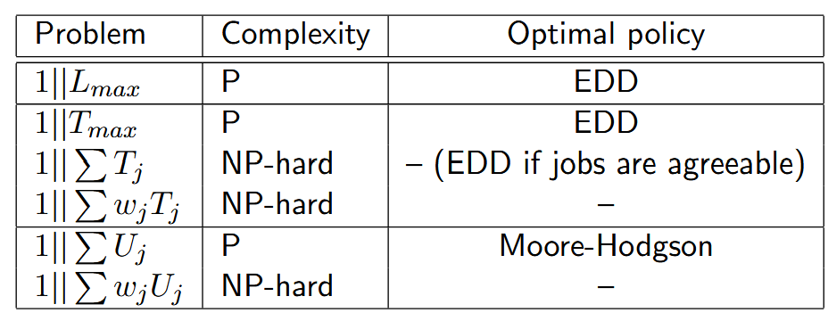

### 1.Due Dates and Performance Measures

>This document extends single-machine scheduling problems to include **due dates (dj​)** for each job. Due dates are treated as "soft" targets, meaning they can be violated, and the goal is to minimize the negative impact of such violations

Three key performance measures are introduced to quantify deviations from due dates

* Lateness: Lj​=Cj​−dj​. This can be positive (late) or negative (early)
* Tardiness: Lj​=Cj​−dj​. This can be positive (late) or negative (early
* Number: Number of Tardy Jobs: A binary measure, Uj​, which is 1 if a job is tardy (Cj​>dj​) and 0 otherwise.

### 2.Minimizing Lateness and Tardiness Objectives

#### 2.1 Total Lateness (1||∑Lj)

>Minimizing the total lateness is equivalent to minimizing the total completion time. This is because the sum of due dates (∑dj​) is a constant, so ∑Lj​=∑Cj​−∑dj​. Therefore, the **Shortest Processing Time (SPT)** rule is optimal

#### 2.2 Minimizing Lateness (1||Lmax) and Maximum Tardiness (1||Tmax)

>To minimize the maximum lateness or maximum tardiness, the optimal policy is the **Earliest Due Date (EDD)** rule. This rule schedules jobs in non-decreasing order of their due dates (dj​).

>The optimality is proven using an "adjacent pairwise interchange" argument, showing that any schedule not in EDD order can be improved by swapping adjacent jobs that violate the order.

>EDD remains the optimal policy even in the stochastic case where processing times are uncertain

#### 2.3 Total Tardiness (1||∑Tj)

>Unlike total lateness, minimizing total tardiness (1∣∣∑Tj​) is **NP-hard** in the general case, meaning no simple optimal rule exists.

>However, for a special case where jobs are **"agreeable"** (meaning a job with a longer processing time also has a later due date, i.e., if pi​≥pj​ then di​≥dj​), the **EDD** rule is optimal.

### 3.Minimizing the Number of Tardy Jobs (1||∑Uj)

>The problem of minimizing the total number of tardy jobs can be solved optimally in polynomial time using **Moore-Hodgson's Algorithm**

The algorithm works as follows:

* Jobs are added one by one to an "on-time" schedule (SO​) in **EDD order**
* If adding a job 'j' makes it late (i.e., its completion time exceeds its due date dj​), the algorithm identifies the job in the current on-time set with the **longest processing time** (pi​) and moves it to a "late" schedule (SL​).
* This process is repeated for all jobs. The final schedule is formed by executing all jobs in the on-time set followed by all jobs in the late set.

>While this algorithm is optimal for the unweighted problem, the weighted version (1∣∣∑wj​Uj​) is NP-hard

