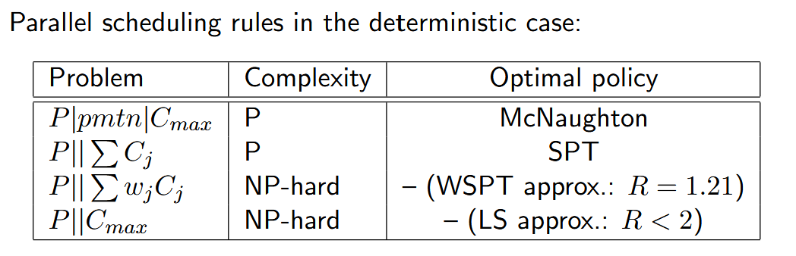

### 1.Parallel Machine Scheduling

This document shifts focus from single-machine to parallel machine scheduling, where 'm' identical machines are available. The core challenge is now twofold: not only determining the sequence of jobs but also assigning each job to a specific machine. A key constraint is that a job cannot be processed on more than one machine simultaneously

Unlike in the single-machine case, minimizing the makespan (P∣∣Cmax​) is no longer a trivial problem; it is now equivalent to a load balancing problem across the available machines

### 2.Minimizing Total Completion Time

$$P||\sum C_j$$

* The optimality of the Shortest Processing Time (SPT) rule extends from the single-machine case to this problem. The optimal strategy is to sort all jobs by their processing time in ascending order and then assign them to the machines in a round-robin fashion.

$$P||\sum w_{j}C_{j}$$

* This weighted version of the problem is NP-hard. While the Weighted Shortest Processing Time (WSPT) rule (assigning jobs in increasing pi​/wi​ ratio order to the next idle machine) is not optimal, it serves as a good approximation with a worst-case ratio of $R=(1+\sqrt{2})/2≈1.21$

### 3.Minimizing Makespan (Cmax)

#### 3.1 Lower Bound for Makespan

The optimal makespan for any parallel machine problem has a lower bound given by M∗=max(pmax​,∑pj​/m). This bound is determined by two factors

* The processing time of the longest job (pmax​), as the schedule must be at least this long.
* The perfectly balanced workload (∑pj​/m), which represents the ideal scenario where all machines finish at the same time.

#### 3.2 Preemptive Case

>This problem can be solved optimally in polynomial time using **McNaughton's wrap-around rule**. The algorithm works by filling the machines sequentially with jobs up to the makespan lower bound M∗. If a job's processing exceeds M∗ on one machine, the remaining part is "wrapped around" and scheduled from time zero on the next available machine.

#### 3.3 Non-Preemptive Case (P||Cmax)

>This problem is NP-hard, even for just two machines (m=2), as it is equivalent to the famous PARTITION problem. Therefore, approximation algorithms are used

**a) List Scheduling (LS)**

>A popular heuristic where, given a priority list of jobs, the highest priority job is sent to the first machine that becomes available

* For an arbitrary priority list, LS has a worst-case approximation ratio of R=2−1/m

**b) Longest Processing Time (LPT)**

>A specific and more effective version of List Scheduling where jobs are prioritized in non-increasing order of their processing times. This improved method has a better worst-case ratio of R=4/3−1/(3m).

