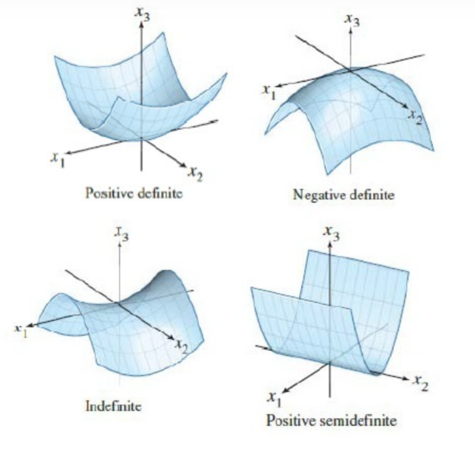

### 1.Symmetric Matrices and Positive Definiteness 

#### 1.1 Symmetric Matrices

**Definition and Key Properties**

>**Definition:**
>
>A matrix is symmetric if it is equal to its transpose
>
>$$A=A^{T}$$
>**Properties**
>
>* **Real Eigenvalues:** 
>	
>	The eigenvalues of any real symmetric matrix are always real numbers.
>	
>* **Orthonormal Eigenvectors:** 
>	
>	A symmetric matrix has a full set of `n` orthonormal eigenvectors. Even in the case of repeated eigenvalues, an orthonormal basis of eigenvectors can be chosen for the corresponding eigenspace.

**The Spectral Theorem**

>**The Decomposition**:
>
>$$A=Q\Lambda Q^{T}$$
>
>**Interpretation:**
>
>This theorem, also known as the principal axis theorem in physics, shows that any symmetric matrix can be represented as a linear combination of orthogonal projection matrices.
>
>$$A=\sum^{n}_{i=1}\lambda_{i}q_{i}q_{i}^{T}$$

**Pivots and Eigenvalues**

>**Sylvester's Law of Inertia:**
>
>For a symmetric matrix, the signs of the pivots match the signs of the eigenvalues. The number of positive pivots is equal to the number of positive eigenvalues, and the same holds for negative pivots/eigenvalues.

#### 1.2 Positive Definite Matrices

**Definition:**

>A matrix is **positive definite** if it is a **symmetric** matrix and all of its **eigenvalues are positive**.

**Tests for Positive Definiteness**

>Eigenvalues: All eigenvalues λi​ are positive (λi​>0).
>
>Pivots: All pivots obtained during elimination (without row exchanges) are positive.
>
>Determinants: All **leading principal minors** are positive. This means the determinants of all upper-left `k x k` submatrices (for k=1 to n) must be positive.

**Properties**

- If A is positive definite, its inverse A−1 is also positive definite.
    
- If A and B are positive definite, their sum A+B is also positive definite.

**Spatial Meaning**

>A 'pure and direction-preserving' scaling transformation. It stretches or compresses space along a set of orthogonal principal axes, but never performs any reflection (flipping) operations, and it preserves the 'relative orientation' of a vector before and after the transformation.

***
### 2.Minima of Positive Definite Matrices 

#### 2.1 Definition and Tests for Positive Definiteness

**Four Equivalent Conditions**

>* **Eigenvalues:** All eigenvalues are positive (λi​>0).
>* **Determinants:** All leading principal minors (upper-left sub-determinants) are positive.
>* **Pivots:** All pivots (from elimination without row exchanges) are positive.
>* **Quadric Form:** The expression xTAx is positive for any non-zero vector `x` (xTAx>0 for x=0). This is often considered the definition of positive definiteness.

**Boundary and Counterexamples**

>**Positive Semidefinte:** 
>
>If a matrix is on the boundary of being positive definite, it is called positive semidefinite. Its eigenvalues are λi​≥0, its pivots are ≥0, and its quadratic form satisfies xTAx≥0.
>
>**Indefinite:**
>
>A symmetric matrix that is not positive definite or semidefinite (having both positive and negative eigenvalues) corresponds to a function with a **saddle point** at the origin, not a minimum.

#### 2.2 The Underlying Justification and Connections

**Connection to Calculus**

>In linear algebra, this second derivative test is equivalent to the **Hessian matrix** (the matrix of second partial derivatives) being **positive definite**. The condition from calculus, $$f_{xx}f_{yy}-(f_{xy})^2>0$$and $$f_{xx}>0$$
>is identical to the determinant and pivot tests for a 2x2 matrix.
>
>**Hessian Matrix:**
>$$H_{ij}=\frac{\partial^2f}{\partial x_{i}\partial x_{j}}$$
>

**The Core Reason: Pivots and Completing the Square**

- The quadratic form xTAx can be rewritten as a sum of squares by using the method of completing the square.
    
- This algebraic process is identical to performing Gaussian elimination on the matrix A.
    
- The coefficients of the squared terms in the completed-square form are precisely the **pivots** of the matrix.
    
- **Conclusion:** For the sum of squares to be positive for any non-zero `x`, all the coefficients (the pivots) must be positive. This explains why the pivot test is a valid condition for positive definiteness.

#### 2.3 The Geometric Interpretation

 - **The "Bowl" Shape:** The graph of the function f(x)=xTAx for a positive definite matrix is a bowl-shaped paraboloid with its minimum at the origin.
    
- **Ellipsoids:** The level sets of this function (e.g., the cross-section where xTAx=1) are ellipses or ellipsoids.
    
- **The Principal Axis Theorem:** The axes of these ellipsoids point in the directions of the **eigenvectors** of the matrix A. The lengths of the axes are determined by the **eigenvalues**. The decomposition A=QΛQT provides the mathematical basis for this geometric fact.

***
### 3.Similar Matrices and Jordan Canonical Form 

#### 3.1 Similar Matrices

**Definition**

$$B=M^{-1}AM$$

**The Key Properties**

>Similar matrices have the **same eigenvalues**.

**Similarity Classes**

>**Case 1: Distinct Eigenvalues** 
>
>If a matrix A has `n` distinct eigenvalues, it is diagonalizable. All matrices with the same `n` distinct eigenvalues are similar to each other, as they are all similar to the same diagonal matrix Λ.
>
>**Case 2: Repeated Eigenvalues:**
>
>If a matrix has repeated eigenvalues, it may not be diagonalizable. Matrices with the same repeated eigenvalues are **not necessarily similar**. They can belong to different "families" of similarity.

#### 3.2 The Jordan Form

**Jordan's Theorem**

>Every square matrix A is similar to a **Jordan matrix J**.

**Jordan Block**

>A Jordan matrix is made of one or more Jordan blocks on its diagonal. A Jordan block has a repeated eigenvalue `λ` on its diagonal, 1s on the superdiagonal, and zeros elsewhere.

**Key Insight**

>The number of linearly independent eigenvectors for a given eigenvalue is equal to the **number of Jordan blocks** corresponding to that eigenvalue. Each Jordan block contributes exactly one eigenvector.

**Uniqueness**

>A matrix's similarity class is uniquely defined by its Jordan form. Two matrices are similar if and only if they share the same Jordan form (including the number and sizes of the blocks), even if they have the same eigenvalues and same number of eigenvectors.

**The Diagonalizable Case**

>**If a matrix is diagonalizable, its Jordan form is the diagonal matrix Λ. Each eigenvalue forms a `1x1` Jordan block.**

