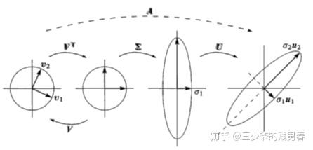

### 1.The Concept of Singular Value Decomposition

#### 1.1 The SVD Formula

**$$A=U\Sigma V^T$$**
**The Components**

- **U:** An `m x m` **orthogonal matrix** whose columns are an orthonormal basis for the output space, Rᵐ.
    
- **Σ (Sigma):** An `m x n` **diagonal matrix** whose diagonal entries, σi​, are the non-negative singular values.
    
- **V:** An `n x n` **orthogonal matrix** whose columns are an orthonormal basis for the input space, Rⁿ.

#### 1.2 The Geometric Goal

- The SVD finds a special orthonormal basis in the row space (`{v₁, ..., vᵣ}`) that is transformed by matrix A into a new orthonormal basis in the column space (`{u₁, ..., uᵣ}`).
    
- This relationship is defined by the equation $$Av_{i}=\sigma_{i} u_{i}$$, where the singular value σi​ is the scaling factor.

***
### 2.How to Compute the SVD

#### 2.1 Finding V and Sigma (from ATA)

- We construct the symmetric matrix ATA. Its spectral decomposition is $$A^{T}A=V(\Sigma^{T} \Sigma)V^{T}$$
- **V:** The columns of V are the **orthonormal eigenvectors** of the matrix ATA.
- **Sigma:** The **singular values** (σi​) are the square roots of the eigenvalues (λi​) of ATA: $$\sigma_{i}=\sqrt{\lambda_{i}}$$

#### 2.2 Finding U (from AAT using V)

- **Method 1:** The columns of U are the orthonormal eigenvectors of the matrix AAT.
    
- **Method 2 (More Reliable):** To avoid sign inconsistencies, it's better to first find V and Σ, and then calculate the columns of U using the relationship $$u_{i}=\frac{1}{\sigma_{i}}Av_{i}$$. This ensures the bases are correctly aligned.

***
### 3.SVD and the Four Fundamental Subspace

>**The SVD provides a complete, orthonormal basis for all four fundamental subspaces of any matrix A. Let the rank of A be `r`.**

- **Row Space C(Aᵀ):** The first `r` columns of V, {v1​,...,vr​}, form an orthonormal basis for the row space.

>The Row Space is the 'truly effective' part of the input space. When the transformation A acts on these vectors, it maps them to non-zero vectors in the output space.

- **Nullspace N(A):** The last `n-r` columns of V, {vr+1​,...,vn​}, form an orthonormal basis for the nullspace.

>The Null Space is the 'completely ineffective' part of the input space. When A acts on these vectors, it squashes them completely to the zero vector.

- **Column Space C(A):** The first `r` columns of U, {u1​,...,ur​}, form an orthonormal basis for the column space.

>The Column Space is the space formed by all possible outputs of the transformation. It is the 'reachable' region in the output space.

- **Left Nullspace N(Aᵀ):** The last `m-r` columns of U, {ur+1​,...,um​}, form an orthonormal basis for the left nullspace.

>The Left Null Space is the 'forever unreachable' region in the output space. It is completely orthogonal to the Column Space.

***
### 4.Applications

The SVD is crucial for solving **least-squares problems**, especially in two difficult scenarios:

1. When A is **not full column rank**, making ATA singular and non-invertible.
    
2. When A is a **very large matrix**, making the computation of ATA too expensive or numerically unstable.