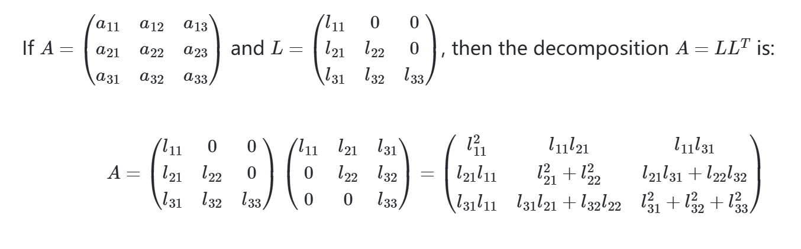

### 1. A=LU - Gaussian Limination

[2.Solving Linear Systemswith Matrix Elimination](2.Solving%20Linear%20Systemswith%20Matrix%20Elimination.md)
### 2. A=QR - Gram-Schmidt Orthonormalization

[1.Orthogonality](1.Orthogonality.md)
### 3. A=PDP^-1 - Spectral Decomposition

[1.Introduction to Eigenvalues and Eigenvectors](1.Introduction%20to%20Eigenvalues%20and%20Eigenvectors.md)

[2.Special Matrices and Their Properties](2.Special%20Matrices%20and%20Their%20Properties.md)

### 4. A=U∑V^T  - Singular Value Decomposition

[2.Signular Value Decomposition](2.Signular%20Value%20Decomposition.md)

### 5. A=LL^T - Cholesky Decomposition

**The Formula**

$$A=LL^{T}$$
>**A**: The original matrix that we want to decompose.
>**L**: A **lower triangular matrix** with strictly positive diagonal entries
>**LT**: The transpose of L, which is an **upper triangular matrix**

**The Algorithm**

>**By solving element by element, from top-left to bottom-right**

**Key Requirements**

>A must be:
>
>**Symmetric:** The product LLT is inherently symmetric, because $$(LL^{T})^{T}=(L^{T})^{T}L^{T}=LL^{T}$$
. If A is not symmetric, it cannot be equal to LLT.
>
>**Positive Definite**
>
>As we will see in the algorithm, the calculation involves taking square roots of certain values. The positive-definite property guarantees that all numbers under the square root sign will be positive, ensuring that the matrix L has real entries and is stable to compute.

**Advantages compared to LU Decomposition**

>**Efficiency:**
>
>It requires only one matrix, L, to be computed and stored, since LT is free. LU requires computing and storing both L and U. This makes Cholesky roughly **twice as fast** as LU decomposition.
>
>**Numerical Stability**
>
>Cholesky decomposition is one of the most stable numerical algorithms. For positive definite matrices, it does not require **pivoting** (row swaps), which is often necessary in LU decomposition to avoid division by small or zero numbers.

**Uniqueness**

>For any symmetric, positive-definite matrix A, the Cholesky decomposition A = LLᵀ is **unique**, provided that the diagonal entries of the lower triangular matrix L are required to be **positive**.
