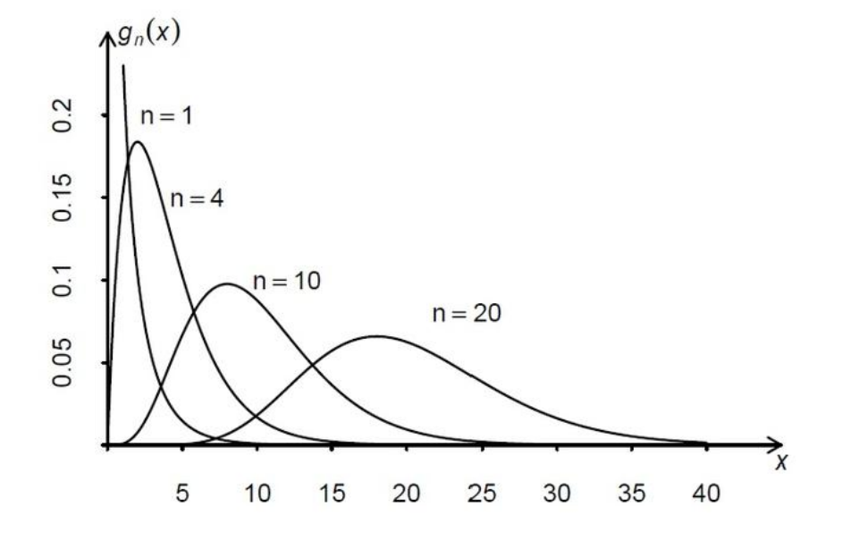

### 1.Definition

Let $X_1, X_2, \dots, X_n$ be a sample from a standard normal distribution $N(0,1)$, and let
$$X = \sum_{i=1}^{n} X_i^2$$
The X is a chi-squared random variable with n degrees of freedom, and its distribution is called the chi-squared distribution with n degrees of freedom, denoted as $$X \sim \chi_n^2$$

### 2.Probability Density

The probability density function (PDF) is:

$$f_n(x) = \begin{cases} \frac{1}{2^{n/2}\Gamma(\frac{n}{2})} x^{\frac{n}{2}-1}e^{-\frac{x}{2}}, & x > 0 \\ 0, & x \le 0 \end{cases}$$

One can observe the relationship between the chi-squared distribution with n degrees of freedom and the Gamma distribution:

$$X = \sum_{i=1}^{n} X_i^2 \sim \Gamma(\frac{n}{2}, \frac{1}{2})$$

### 3.Properties

* Expectation: $E(\chi_n^2)=n$
* Variance: $Var(\chi_n^2)=2n$
* Additive Property: If $X \sim \chi_{n_1}^2, Y \sim \chi_{n_2}^2$, and X, Y are independent, then $$X+Y \sim \chi_{n_1+n_2}^2$$
### 4.Upper α-Quantile

>If $X \sim \chi_n^2$, and we set $P(X > c) = \alpha$, then c, denoted as $\chi_\alpha^2(n)$, is called the upper α-quantile of the $\chi_n^2$​ distribution.
