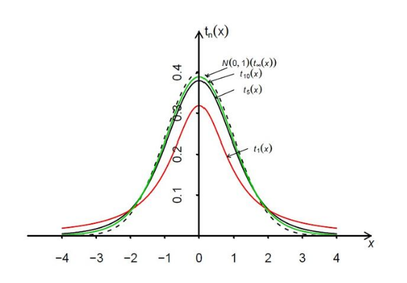

### 1.Definition

Let the random variables $X \sim N(0,1), Y \sim \chi_n^2$, and let X, Y be independent. Then we define:

$$T = \frac{X}{\sqrt{Y/n}}$$

as a t-distributed variable with n degrees of freedom, and its distribution is called the t-distribution with n degrees of freedom, denoted as $T \sim t_n$.

### 2.Probability Density

$$t_n(x) = \frac{\Gamma(\frac{n+1}{2})}{\Gamma(\frac{n}{2})\sqrt{n\pi}} \left(1 + \frac{x^2}{n}\right)^{-\frac{n+1}{2}}, \quad (x \in \mathbb{R})$$

The relationship between the t-distribution and the normal distribution is easily obtained:

$$\lim_{n \to \infty} t_n(x) = \varphi(x)$$

### 3.Properties

**Expectation**: When $n \ge 2$, $E(T) = 0$.

**Variance**: When $n \ge 3$, $Var(T) = \frac{n}{n-2}$.

### 4.Two-sided α-Quantile

If $T \sim t_n$, and we set $P(|T| > c) = \alpha$, then $c = t_{\alpha/2}(n)$ is called the two-sided α-quantile of the t-distribution with n degrees of freedom.

