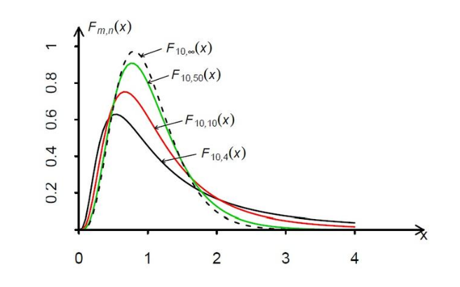

### 1.Definition

Let the random variables $X \sim \chi^2(m), Y \sim \chi^2(n)$, and let X, Y be independent. Then we define:

$$F = \frac{X/m}{Y/n}$$

as an F-distributed variable with m and n degrees of freedom. Its distribution is called the F-distribution with m and n degrees of freedom, denoted as $F \sim F(m, n)$.

### 2.Probability Density

$$f_{m,n}(x) = \frac{\Gamma(\frac{m+n}{2})}{\Gamma(\frac{m}{2})\Gamma(\frac{n}{2})} \left(\frac{m}{n}\right)^{\frac{m}{2}} x^{\frac{m}{2}-1} \left(1 + \frac{m}{n}x\right)^{-\frac{m+n}{2}}, \quad (x > 0)$$

### 3.Properties

If $Z \sim F(m,n)$, then $\frac{1}{Z} \sim F(n,m)$.

If $T \sim t_n$, then $T^2 \sim F(1,n)$.

$F_{1-\alpha}(m,n) = \frac{1}{F_{\alpha}(n,m)}$

### 4.Upper α-Quantile

If $F \sim F(m,n)$, and we set $P(F > c) = \alpha$, then $c = F_{\alpha}(m,n)$ is called the upper α-quantile of the F-distribution.